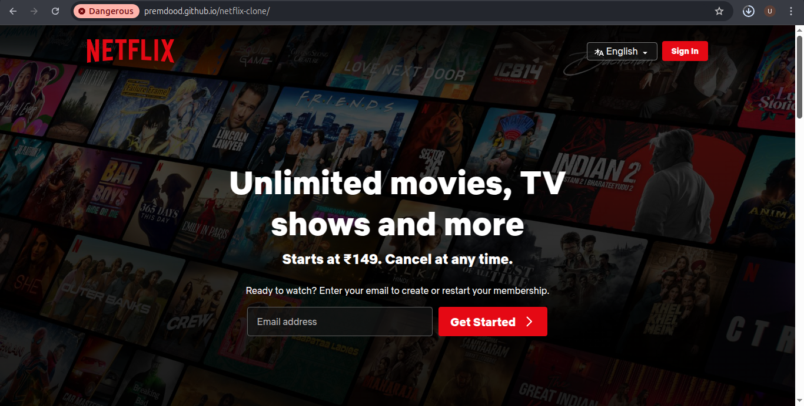
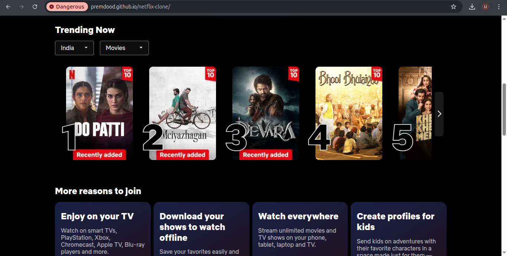

# Netflix Landing Page Clone

## 📺 Project Overview

This project is a responsive clone of the Netflix landing page, created using pure HTML, CSS, and JavaScript. It demonstrates the ability to recreate a modern, interactive web interface with attention to design and user experience.

## 🌐 Live Demo

[View Live Demo](https://premdood.github.io/netflix-clone)

## 🌟 Features

- Fully responsive design
- Animated sections mimicking Netflix's original landing page
- Interactive FAQ
- Email validation
- Smooth transitions and hover effects
- Modern, clean UI that closely resembles the Netflix landing page

## 🚀 Technologies Used

- HTML5
- CSS3 (Flexbox & Grid)
- Vanilla JavaScript
- Responsive Design Techniques

## 📸 Screenshots

### Desktop View



## 🛠 Installation

### Prerequisites
- Web browser (Chrome, Firefox, Safari, Edge)
- Text editor (VS Code, Sublime Text, etc.)

### Steps
1. Clone the repository
```bash
git clone https://github.com/premdood/netflix-clone.git
```

2. Navigate to the project directory
```bash
cd netflix-clone
```

3. Open `index.html` in your preferred web browser

## 🔍 Key Components

### HTML Structure
- Semantic HTML5 markup
- Responsive layout sections
- Accessibility considerations

### CSS Styling
- Flexbox and Grid for layout
- Media queries for responsiveness
- Hover and transition effects

### JavaScript Functionality
- Email input validation
- Smooth scrolling
- Interactive elements

## 🏆 Challenges Overcome

- Replicating Netflix's complex layout
- Creating responsive design
- Implementing interactive FAQ section

---

**Disclaimer**: This project is for educational purposes only and is not affiliated with Netflix.
